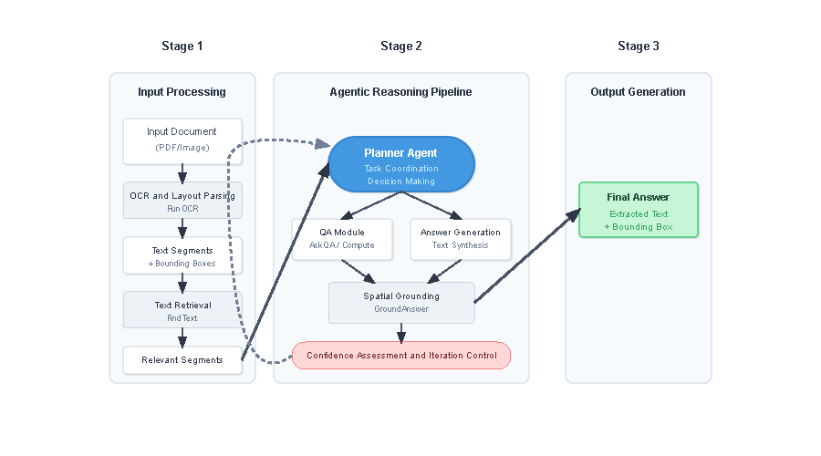

# ARIAL Framework Implementation

This project is a Python implementation of the ARIAL (Agentic Reasoning for Interpretable Answer Localization) framework for Document Visual Question Answering (DocVQA).
img/arc.pdf



## Features

- **End-to-End DocVQA**: Takes a document image and a question, and returns a textual answer with its bounding box.
- **Modular Architecture**: Built with separate components for OCR, text retrieval, question answering, spatial grounding, and computation.
- **Agentic Reasoning**: An LLM-powered planner agent orchestrates the workflow, deciding which tool to use at each step.
- **Powered by Hugging Face**: Leverages pre-trained models from the Hugging Face Hub for its core functionalities.

## Project Structure

```
.
├── README.md
├── main.py                 # Main script to run the ARIAL pipeline
├── arial                   # Main package
│   ├── __init__.py
│   ├── agent               # Contains the PlannerAgent
│   │   ├── __init__.py
│   │   └── planner_agent.py
│   └── tools               # Contains all the individual tools
│       ├── __init__.py
│       ├── compute.py
│       ├── grounding.py
│       ├── ocr.py
│       ├── qa.py
│       └── retrieval.py
├── documents               # Example documents
│   └── sample_document.pdf
├── requirements.txt        # Python dependencies
└── .gitignore              # Git ignore file
```

## Getting Started

### Prerequisites

- Python 3.9+
- An NVIDIA GPU is highly recommended for running the models.

### Installation

1.  **Clone the repository:**
    ```bash
    git clone <repository_url>
    cd <repository_name>
    ```

2.  **Create a virtual environment:**
    ```bash
    python -m venv venv
    source venv/bin/activate
    ```

3.  **Install dependencies:**
    ```bash
    pip install -r requirements.txt
    ```

4.  **Set up environment variables:**

    Create a `.env` file by copying the example:
    ```bash
    cp .env.example .env
    ```

    Open the `.env` file and add your Hugging Face Hub token. This is required to download and use certain models like Llama 3.
    ```
    HUGGING_FACE_HUB_TOKEN="your_hf_token_here"
    ```

### Running the Application

Place your document images in a directory (e.g., `documents/`).

Run the `main.py` script with the path to your document and your question:

```bash
python main.py --document_path "path/to/your/document.png" --question "What is the total amount due?"
```

The script will download the necessary models on the first run, which might take some time.

## How It Works

The ARIAL framework operates in three stages:

1.  **Stage 1: Input Processing**: The `OCRProcessor` implements a two-stage OCR process:
    - **Text Detection**: Uses DB (Differentiable Binarization) via `doctr` to identify text regions
    - **Text Recognition**: Uses Microsoft's TrOCR model to transcribe text within detected regions
    - **Preprocessing**: Includes image enhancement, resizing, and contrast adjustment

2.  **Stage 2: Agentic Reasoning**: The `PlannerAgent`, powered by Llama-3-8B-Instruct, automatically starts with OCR and uses a "Sense-Think-Act" loop with few-shot examples to decide which tool to call next. The available tools are:
    -   `TextRetriever`: Finds relevant text segments using semantic (sentence-transformers) and lexical search
    -   `QAModule`: Generates textual answers using Gemma-2B-IT
    -   `SpatialGrounder`: Locates answers on the document with contextual disambiguation using question keywords
    -   `ComputeModule`: Performs numerical calculations for questions requiring computation

3.  **Stage 3: Output Generation**: The final answer and its precise bounding box coordinates are returned.

## Key Features

- **True Two-Stage OCR**: Separate detection and recognition stages using state-of-the-art models
- **Contextual Grounding**: Disambiguates multiple answer candidates using proximity to question keywords
- **Automatic Initialization**: Agent automatically starts with OCR extraction
- **Few-Shot Learning**: Uses example reasoning traces to guide the agent's decision-making
- **Robust Error Handling**: Comprehensive error handling throughout the pipeline
